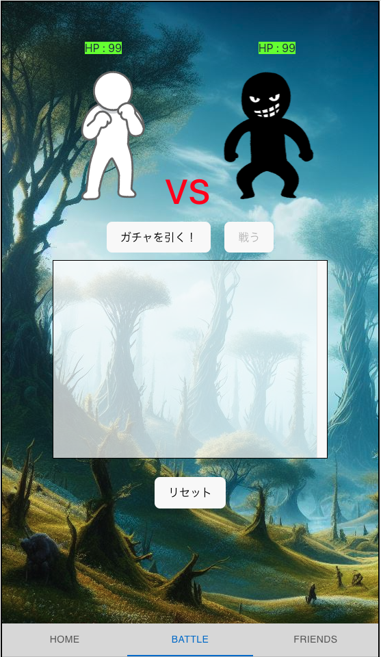
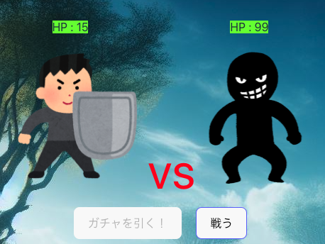
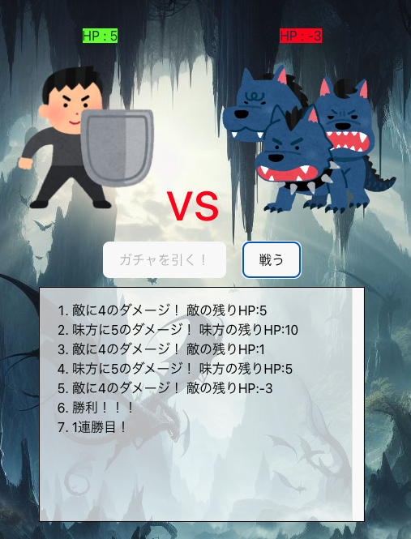
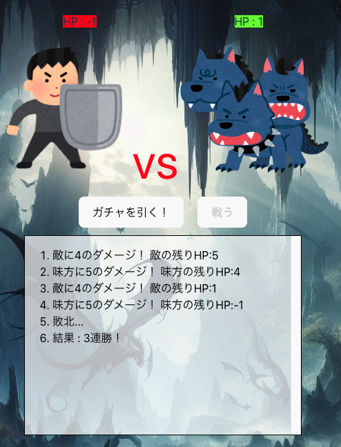
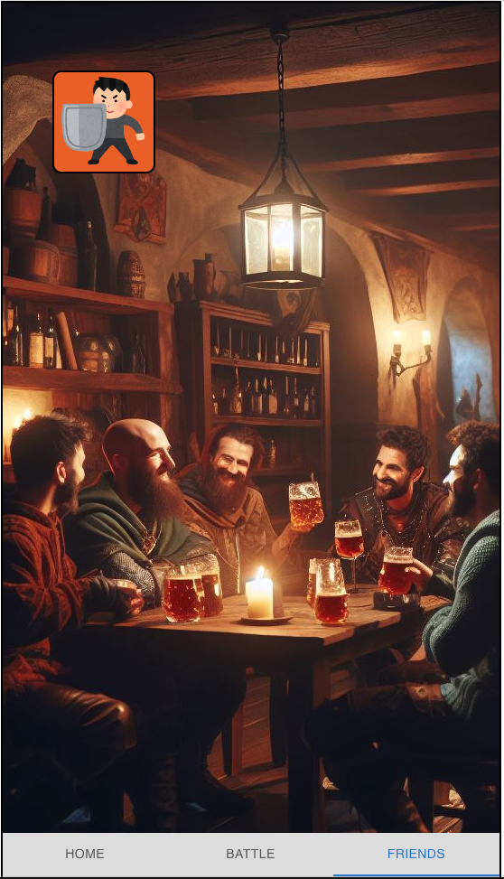
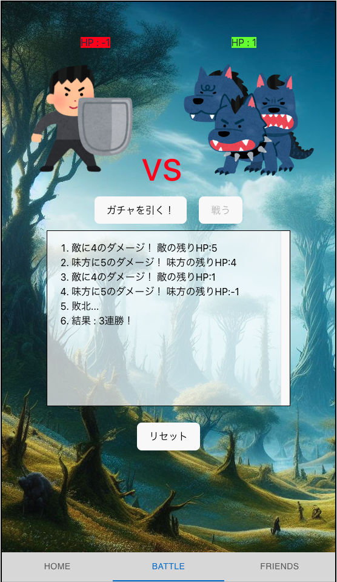
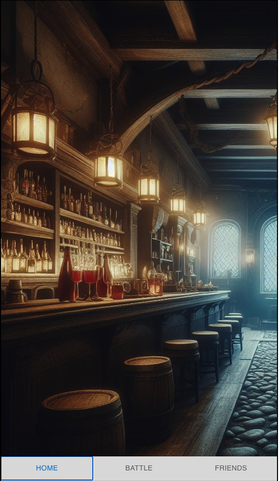

# Gacha Quest

## 概要

ガチャを回して出てきたキャラクターで戦うゲーム。  
ランダムなキャラが出現し続け、自分のキャラの HP が無くなるまで戦い続けられる。

## 遊び方

 

BATTLE 画面の**ガチャを引く**を押して、キャラクターをゲット！

 

キャラクターが表示されたら**戦う**を押して BATTLE 開始！

 

勝利をしたら、さらに**戦う**をクリックして連戦！

 

HP が無くなったら**GAME OVER**

何連勝できるか遊んでみてね！

## 収集要素

 

ガチャで手に入ったキャラクターは FRIENDS 画面から確認できるよ

**目指せコンプリート！！！**

## ゲームのリセット

 

BATTLE 画面の**リセット**で画面と FRIENDS 画面の収集履歴を初期化ができるよ

 

## 未完成

時間の関係上、HOME 画面は未完成です。  

