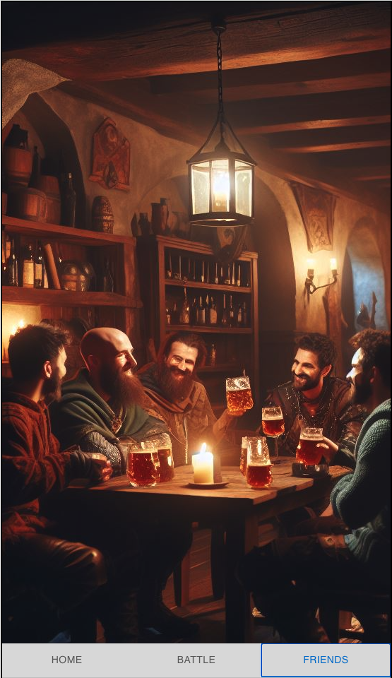

# Gacha Quest

## 概要

ガチャを回して出てきたキャラクターで戦うゲーム。  
ランダムな敵キャラが出現し続け、自分のキャラの HP が無くなるまで戦い続けられる。

## セットアップ

依存パッケージをインストールする

```
npm install
```

psql で DATA BASE、solo を作成

```
CREATE DATABASE solo
```

maigration の実行で DATA TABLE を作成

```
npm run latestMigration
```

seed の実行でデータを登録

```
npm run runSeed
```

ターミナルでサーバー起動

```
npm run server
```

サーバーが立ち上がったら、http://localhost:8000 からアクセス

開発時は別ターミナルから、クライアント側のコマンドを実行

```
npm run dev
```

http://localhost:5173/ からアクセス

## 遊び方

BATTLE 画面の**ガチャを引く**を押して、キャラクターをゲット！


キャラクターが表示されたら**戦う**を押して BATTLE 開始！


勝利をしたら、さらに**戦う**をクリックして連戦！


HP が無くなったら**GAME OVER**

何連勝できるか遊んでみてね！

 

## 収集要素

ガチャで手に入ったキャラクターは FRIENDS 画面から確認できるよ

 

**目指せコンプリート！！！**

## ゲームのリセット

BATTLE 画面の**リセット**で画面と FRIENDS 画面の収集履歴を初期化ができるよ

 


 

## 未完成

時間の関係上、HOME 画面は未完成  


## 今後の拡張機能

・敵味方のガチャのキャラ拡充  
・味方のキャラにレベルアップ追加  
・連勝する毎に敵のスキル上昇  
・味方キャラを複数隊連れていける  
・防御の値を実装  
・攻撃のダメージに乱数要素を追加  
・戦闘を一瞬ではなく順番に行わせる  
・戦闘に動きをつける  
・戦闘のスピードを変えられるようにする  
・お金を実装し階層に応じてお金が手に入る  
・お金でレアガチャが回せる  
・キャラに属性をつける  
・属性毎のステージを作る  
・武器ガチャを追加  
・武器を装備できるようにする
